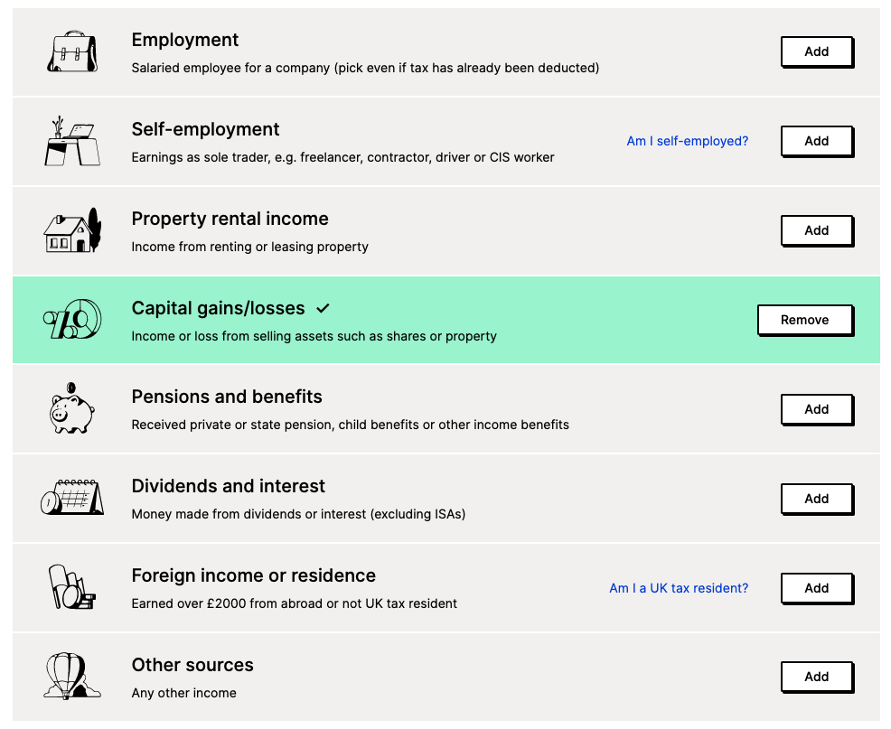
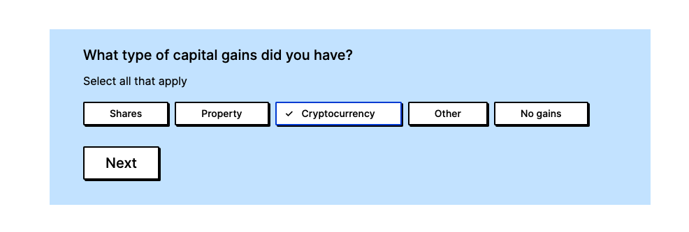
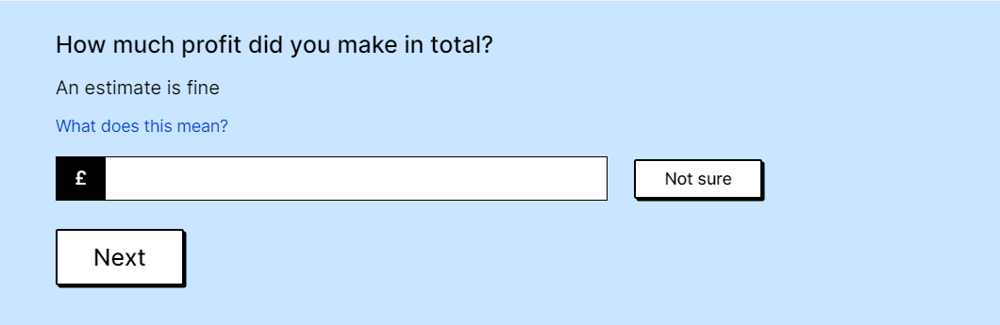
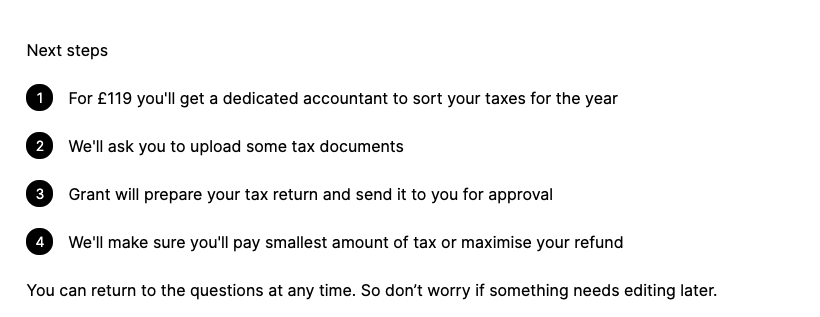
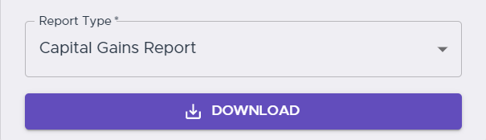

# TaxScouts guide

CryptoTaxCalculator is proud to support [TaxScouts](https://taxscouts.com/?referralSource=CryptoTaxCalculator), an online tax preparation tool in the UK and Spain. They sort your Self Assessment tax return for £119, all in - and CryptoTaxCalculator users get 10% off too! It's fast, online and done by a certified accountant. Follow these steps to get your tax return sorted out.

## 1. Visit the TaxScouts website

Click [here](https://taxscouts.com/?referralSource=CryptoTaxCalculator) to access the TaxScouts website. You can then create an account to get started or log in if you already have an account.

## 2. Reason for tax return

You will be prompted to choose your reason for preparing a tax return. Select the "I earned capital gains" option as below.

## 3. Sources of income

Next, you have to select all the ways you earned income in the tax year. Add "Capital gains/losses" as your source of income. Make sure you also add any other listed sources of income that apply to you, such as Employment.

## 4. Questions

You will first be asked about what type of capital gains you had. Select "Cryptocurrency."

Once you press 'Next', you will be asked to enter how much profit you made in total.

After this, you will be asked how many cryptocurrency sales transactions you undertook, and whether you reported them using 'Real time capital gains service.'

If you are unsure about your answer to any of these above questions, there is an option to choose "Not sure" or "Don't know" for these questions.

## 5. Assigning an accountant

Now that you have entered your details, you can proceed to the next step where you pay and TaxScouts assign you an accountant to file your tax return. Once this has happened, you will be required to upload some documents to support the tax return.

## 6. Import your Capital Gains Report from CryptoTaxCalculator

Navigate to [CryptoTaxCalculator](https://app.cryptotaxcalculator.io). Once you have logged in, you can navigate to the 'Get Report' section of the page and download your Capital Gains Report as a CSV file. Make sure that all your transactions have been covered in the report. You can then import this file into the TaxScouts website.

Once the CSV file has been uploaded, your accountant will have sufficient information to handle your cryptocurrency taxes. However, you will also need to provide documentation for your other sources of income, e.g. employment. Finally, you can accept the terms of engagement and the accountant will be able to prepare your tax return.
